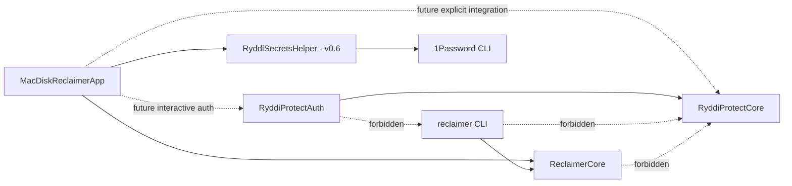

# Ryddi Protect Security Boundaries

## Purpose

Protect adds cloud evidence and secret-hygiene guidance to a disk cleanup app. That combination is unusually sensitive: cloud metadata can expose private names and history, provider sessions grant remote authority, dotenv files contain credentials, and cleanup already has local mutation authority.

The design therefore separates evidence, credentials, values, and cleanup capabilities. A component that can inspect provider metadata cannot delete local data. A component that can move local data cannot read provider credentials. A matching cloud filename or size is never backup proof.

## Capability Graph

| Component | May handle | Must not handle |
| --- | --- | --- |
| `ReclaimerCore` | Local findings, path policies, file identity, dry runs, one-use Trash authorization | Provider SDKs, OAuth, Keychain, account metadata, secret values |
| `RyddiProtectCore` | Runtime-only provider metadata, inert protection assessments, PKCE primitives, metadata-only secret findings | Keychain access, UI sessions, cleanup execution, secret values, provider mutation APIs |
| `RyddiProtectAuth` | Opaque refresh tokens or MEGA resume sessions and Keychain operations | Cleanup execution, audit persistence, secret-source values, remote file mutation |
| `MacDiskReclaimerApp` | User consent, system-browser authentication, bounded presentation state | Long-lived plaintext credentials, unattended Protect work |
| `reclaimer` | Local metadata reports and redacted evidence | Linking `RyddiProtectAuth`, reading cloud credentials, value-bearing migration |
| `RyddiSecretsHelper` | One explicitly approved source and one bounded migration plan in v0.6 | Shell execution, arbitrary binaries, logs containing values, cleanup authority |

## Security Invariants

1. `ReclaimerCore` remains the only local cleanup authority and never imports Protect or provider code.
2. Protect assessments are advisory only and cannot change a finding's safety class, select cleanup, or bypass scan, plan, dry-run, open-handle, identity, confirmation, or Trash checks.
3. Every assessment is runtime-only and bound to an exact scan session, finding, and Protect-owned `ProtectionFilesystemIdentity`; it contains no raw local path and no cleanup-eligible state. Any future app conversion to cleanup identity is explicit and app-owned.
4. If verified protection evidence is ever allowed to influence cleanup, it must extend the existing process-memory-only, one-use `TrashExecutionAuthorizationRegistry`; Protect must not create a second authorization store.
5. Raw provider connection identities, object IDs, names, paths, revisions, and local/provider correlations are not `Codable`. The foundation persists none of them.
6. Cloud adapters in `v0.5` expose metadata reads only. They have no upload, delete, move, rename, share, overwrite, or prune capability.
7. The CLI cannot link the credential target. Authentication is interactive and app-owned.
8. Initial secret discovery opens no candidate file content. Key-name inspection is a separate explicit action, and secret-value migration is a later isolated process.
9. No secret value, OAuth token, MEGA session, 1Password reference, account email, or raw provider path enters argv, logs, reports, audit JSON, crash metadata, analytics, or clipboard state.
10. Provider SDKs are pinned and isolated in provider-specific targets so metadata-only code cannot accidentally gain mutation authority.
11. An unreadable, corrupt, oversized, or symlink-substituted user path policy protects `/` for enforcement and cannot be mutated or exported. Missing policy remains a distinguishable, empty, mutable first-run state.
12. Provider-derived path protection is represented only as a runtime-only, additive `.protect` proposal. It has no policy-store reference and requires a later explicit user confirmation path.
13. `RyddiProtectCore` has no package dependency on `ReclaimerCore`; the compiler prevents metadata and evidence code from reaching cleanup, authorization, or path-policy mutation APIs.
14. Every authorized Trash item reloads current path policy, honors newly added rules, and re-computes the scan-session policy digest immediately before mutation. Missing loader state, invalid policy, or any digest change blocks Trash.

## Authentication Decisions

### macOS Keychain

Provider resume material uses the macOS data-protection Keychain. Each item sets `kSecUseDataProtectionKeychain=true` and `kSecAttrAccessibleWhenUnlockedThisDeviceOnly`. Ryddi omits `kSecAttrSynchronizable` so items remain device-local. Service names are provider-scoped; account keys are connection UUIDs, never emails or provider usernames. A non-sensitive Keychain attribute stores only the Ryddi connection ordinal, allowing a relaunched app to enumerate `CloudConnectionLocator` values without loading credential bytes or persisting provider account identity elsewhere.

Apple recommends the data-protection Keychain for modern `SecItem` use on macOS and advises handling access failures rather than relying on a racy unlock preflight: [On Mac Keychains](https://developer.apple.com/forums/thread/696431), [SecItem pitfalls and best practices](https://developer.apple.com/forums/thread/724013).

### OAuth and Dropbox

Desktop OAuth uses authorization code plus PKCE S256, exact callback state, one-use codes, and no bundled client secret. Dropbox requests only the scopes needed by its read-only adapter and stores a refresh token only when resume is required. Dropbox explicitly recommends PKCE for desktop public clients: [Dropbox OAuth guide](https://developers.dropbox.com/oauth-guide).

### Google Drive

Google Drive uses the official desktop/mobile Picker authorization flow in the system browser with exactly `drive.file`. The flow returns user-selected file IDs with the authorization callback. Ryddi does not request broad Drive scopes, combine identity scopes, embed a JavaScript Picker, or run a local/hosted relay: [Drive scope guidance](https://developers.google.com/workspace/drive/api/guides/api-specific-auth), [desktop/mobile Picker](https://developers.google.com/workspace/drive/picker/guides/desktop-mobile-picker).

### MEGA

MEGA has no comparable narrow OAuth scope. Its official SDK is therefore isolated behind a read-only adapter and a source-level mutation denylist. Password and MFA values remain ephemeral UI state; only the SDK resume session may enter the Keychain. Ryddi never invokes MEGAcmd or prints a session: [official MEGA SDK](https://github.com/meganz/sdk).

### 1Password

`v0.5` performs metadata-only discovery and official handoffs. `v0.6` may create a reviewed item through structured JSON on stdin because 1Password warns that command arguments can be visible to other processes. Ryddi never puts sensitive assignments in argv: [1Password item creation](https://www.1password.dev/cli/item-create), [1Password Environments](https://www.1password.dev/environments).

## Threats and Controls

| Threat | Preventive control | Required proof |
| --- | --- | --- |
| OAuth callback interception or substitution | PKCE S256, cryptographic state, exact callback scheme/host, duplicate-parameter rejection, short timeout | Deterministic callback tests and provider sandbox smoke |
| Token theft from disk or sync | Data-protection Keychain, device-only accessibility, no sync attribute, no file fallback | Fake backend query tests and packaged-app Keychain smoke |
| Scope creep | Provider-specific exact scope allowlists; Google `drive.file` only | Authorization URL snapshot and returned-scope validation |
| Malicious provider metadata | Raw-byte declarations plus canonical metadata accounting, count limits, control-character rejection, stable-ID conflict detection, cancellation and truncation | Shared adapter conformance harness plus provider parser fixtures |
| False backup match authorizes cleanup | Protect assessments are inert; filename/size never authorize cleanup; any future handoff must bind verified content evidence into the existing Trash authorization registry | Negative match tests and full fake-provider flow |
| Secret values leak through models or errors | No value-bearing `Codable` models; isolated helper; stdin only; redacted errors | Canary scan across argv, logs, reports, audits, temp, crash artifacts |
| TOCTOU between assess and cleanup | Assessment binds Protect-owned identity evidence; ReclaimerCore reloads and re-digests policy and retains final metadata/rule/open-handle checks plus its existing one-use Trash capability | Identity/symlink/type/open-handle/policy-change race tests |
| Provider SDK exposes mutation | Provider-specific target, narrow adapter protocol, source denylist, no writer protocol in v0.5 | Architecture tests and dependency manifest |
| Corrupt or concurrent policy mutation silently disables protection | Descriptor-bound reads, typed load state, fail-closed root protection, stable process/file mutation locks, private permissions, atomic replace, exact-byte readback | Corrupt/unreadable/oversized/symlink and concurrent app/CLI regression suite |
| Provider inventory is partial but looks complete | Typed completion and issue states; object/page/response/time/retry bounds; cursor-cycle and conflicting-ID rejection | Scripted adapter inventory suite |
| Audit becomes a privacy database | Redacted persistence types, installation-keyed hashes, bounded retention and manual pruning | Round-trip redaction and canary leak tests |
| Secret migration leaves user worse off | Source untouched until create/reference/equality checks pass; same-volume quarantine; restore receipt; no automatic item deletion | Kill-point and rollback matrix in v0.6 |

## Current Foundation Slice

The first slice is intentionally non-functional from the UI. It adds:

- a compiler-enforced capability boundary with no `RyddiProtectCore` dependency on cleanup code;
- runtime-only cloud contracts with bounded untrusted metadata;
- inert protection assessments bound to scan, finding, and filesystem identity;
- PKCE and Keychain primitives in separate capability targets;
- metadata-only secret-source discovery;
- descriptor-bound user path policy storage that fails closed on untrusted state;
- inert additive protection proposals that cannot save, remove, replace, or exclude policy;
- a serial provider-neutral inventory builder with bounded objects, raw-plus-canonical response accounting, absolute request deadlines, clamped retries, cancellation, and explicit partial-result states;
- architecture tests that reject reverse dependencies and mutation APIs.

It does not connect a provider, issue a live network request, persist cloud inventory, perform a real Keychain operation, inspect a dotenv value, upload a file, migrate a secret, influence cleanup classification, authorize cleanup, or add Protect navigation. ReclaimerCore, the app, and the CLI do not link the Protect targets in this slice.

Raw response-byte measurement and invalid UTF-8 rejection belong at each future provider adapter before constructing `CloudInventoryPage` and Swift `String` values. The shared page contract accounts at least the canonical bounded metadata cost even if an adapter underreports raw bytes. Every adapter request receives one absolute monotonic `CloudRequestContext` deadline, and the builder independently returns a typed timeout even if an adapter fails to cooperate with cancellation. Adapters must still enforce the deadline in their own URLSession/SDK request so a cancelled operation cannot retain transport resources. A provider adapter cannot ship until its parser fixtures and shared conformance harness prove that raw boundary.

## Release Stop Conditions

Do not ship a provider if its narrow scope cannot be proven, its native dependencies cannot be recursively signed, its adapter can reach remote mutation APIs, or its sandbox smoke uses production user data. Do not ship value migration if any canary appears in process arguments, inherited environment, stdout, stderr, logs, reports, audits, temporary files, or crash/core artifacts.
