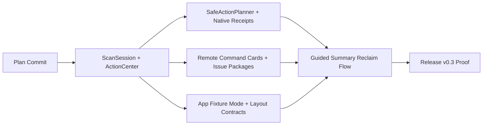

# Ryddi v0.3 Trust-To-Action Release Master Plan

> **For Reidar:** REQUIRED SUB-SKILL: Use `superpowers:subagent-driven-development` or `superpowers:executing-plans` to implement this plan task-by-task.

**Goal:** Ship Ryddi `v0.3.0` as the release where the app moves from "rich evidence viewer" to "guided, trustworthy action system." Users should open the app, understand what matters now, grant missing access, run a scan, review the safest next actions, dry-run the selected work, execute only tightly scoped local actions, and recover or audit what happened.

**Architecture:** Keep the current SwiftPM architecture. `ReclaimerCore` remains the source of truth for scanning, rules, sessions, action selection, receipts, audit storage, remote reports, and release evidence. The `reclaimer` CLI exposes proof paths. `MacDiskReclaimerApp` becomes a decision cockpit over the same core. Remote Targets stay report-only in `v0.3.0`.

**Tech Stack:** Swift 6, SwiftUI, SwiftPM, macOS 14+, system tools (`lsof`, `ssh`, `brew`, package manager CLIs), GitHub Actions, Developer ID signing, Apple notarization.

## Product Direction

Ryddi `v0.3.0` should be the "trust-to-action" release.

The current app can find and classify storage bloat, but the user still has to infer which sequence is safe. `v0.3.0` should convert evidence into guided workflows:

- What should I do first?
- Why is it safe or blocked?
- What exact bytes might be reclaimed?
- Which app/tool needs to be quit or used manually?
- What happened after a dry run or execution?
- How do I recover or prove what changed?

The release should not chase broad cleaner features before the critical local loop is excellent. Remote Targets should become more useful for VPS reports, but still never execute remote cleanup.

## Global Constraints

- Minimum OS remains macOS 14+.
- No telemetry, path upload, remote AI analysis, root helper, Mac App Store sandboxing, password capture, sudo password flow, or unattended destructive maintenance.
- Before long build/test loops run:

```bash
df -h /System/Volumes/Data
```

- Stop and report if free space is below `50Gi`.
- Use bounded Swift build paths:

```bash
swift test --scratch-path "$PWD/.build"
swift build --scratch-path "$PWD/.build"
```

- For app build checks use bounded derived data:

```bash
xcodebuild -derivedDataPath "$PWD/.derivedData" ...
```

- Preserve by default: GarageBand/Logic assets, browser profiles, VM/container disks and volumes, Codex sessions/memories/config/auth, credentials, app state databases, user documents, Photos libraries, backups, remote databases, `/etc`, and unknown state.
- Direct delete remains limited to allowlisted reproducible caches after final open-handle, symlink, metadata, policy, and classification checks.
- Use Trash or Ryddi holding area for uncertain user-visible local removals.
- Remote Targets remain report-only: no `remote execute`, no `remote prune`, no `remote reset`, no remote `--yes`.
- Release claims must be evidence-backed by signed, notarized, stapled, Gatekeeper-accepted artifacts and a manifest.

## Release Interfaces

Update package metadata and scripts so release artifacts use:

- Version: `0.3.0`
- Build number: `3`
- Artifact basename: `Ryddi-v0.3.0`
- App: `dist/Ryddi.app`
- Zip: `dist/Ryddi-v0.3.0.zip`
- Checksum: `dist/Ryddi-v0.3.0.zip.sha256`
- Manifest: `dist/Ryddi-release-manifest.txt`

Add these user-visible CLI surfaces:

```text
reclaimer session latest [--json]
reclaimer session explain [--json]
reclaimer actions [--json] [--preset developer|general|all]
reclaimer issue package --path-style redacted --output DIR
```

Keep existing commands stable. New JSON fields must be additive.

## Workstreams

### Workstream 1: Scan Sessions And Action Center

Implement a persistent session model that links scan, queue review, plan, dry-run, execution receipt, recovery state, and recommended next actions.

Plan file:

- `docs/superpowers/plans/2026-07-09-ryddi-v0.3-scan-session-action-center.md`

Primary deliverables:

- `ScanSession`
- `ScanSessionStore`
- `ActionCenterReport`
- CLI `session` and `actions` commands
- Summary-first app action center

Required verification:

```bash
swift test --scratch-path "$PWD/.build" --filter ScanSession
swift test --scratch-path "$PWD/.build" --filter ActionCenter
```

### Workstream 2: Safe Local Actions And Native Receipts

Make a few local actions genuinely useful while preserving Ryddi's trust posture: Homebrew cleanup through native command receipts, Ryddi audit pruning, safe app-bundle Trash flow, and package-cache manual guidance.

Plan file:

- `docs/superpowers/plans/2026-07-09-ryddi-v0.3-safe-actions-and-native-receipts.md`

Primary deliverables:

- Safe action candidates
- Native command receipts
- Better dry-run-to-execute progression
- Strong final gate revalidation
- App uninstall and audit-prune cockpit flows

Required verification:

```bash
swift test --scratch-path "$PWD/.build" --filter SafeAction
swift test --scratch-path "$PWD/.build" --filter NativeAction
swift test --scratch-path "$PWD/.build" --filter ExecutorFinalGate
```

### Workstream 3: Remote Targets Polish And Issue Packages

Improve remote VPS usefulness without remote cleanup: command cards, manual native guidance, remote growth comparisons, partial coverage states, and redacted issue packages.

Plan file:

- `docs/superpowers/plans/2026-07-09-ryddi-v0.3-remote-polish-and-issue-packages.md`

Primary deliverables:

- `RemoteManualCommandCard`
- Remote growth and coverage summaries
- More useful remote native guidance
- Redacted local issue package export
- Remote UI copyable command cards

Required verification:

```bash
swift test --scratch-path "$PWD/.build" --filter RemoteCommandCard
swift test --scratch-path "$PWD/.build" --filter RemoteGrowth
swift test --scratch-path "$PWD/.build" --filter IssuePackage
```

### Workstream 4: App E2E, Small-Window Polish, And Release Proof

Make the installed app demonstrably usable: first-run access path, empty states, summary action, review detail, dry-run gating, recovery/audit surfaces, responsive layout, and signed release proof.

Plan file:

- `docs/superpowers/plans/2026-07-09-ryddi-v0.3-app-e2e-and-release-proof.md`

Primary deliverables:

- App E2E fixture mode
- App smoke script
- Responsive layout constraints
- Screenshot-backed small-window checks
- `v0.3.0` release proof path

Required verification:

```bash
swift test --scratch-path "$PWD/.build" --filter MacDiskReclaimerApp
swift build --scratch-path "$PWD/.build"
Scripts/app-e2e-smoke.sh
Scripts/release-check.sh
```

## Implementation Order

- [ ] Create branch `feature/v0.3-trust-to-action` from clean `main`.
- [ ] Commit these plan files first with message `docs: plan v0.3 trust-to-action release`.
- [ ] Run disk guardrail.
- [ ] Run baseline tests:

```bash
swift test --scratch-path "$PWD/.build"
swift build --scratch-path "$PWD/.build"
Scripts/release-check.sh
```

- [ ] Implement Workstream 1 before UI-heavy work so app screens can consume stable session/action APIs.
- [ ] Implement Workstream 2 next so Action Center can produce real local action candidates.
- [ ] Implement Workstream 3 after local action APIs so remote stays separate and clearly report-only.
- [ ] Implement Workstream 4 throughout, but land final E2E/release proof after the core interfaces settle.
- [ ] Run full verification.
- [ ] Update release notes and docs.
- [ ] Create signed/notarized `v0.3.0` release only after release proof passes.

## Workstream Dependencies

The implementation should avoid parallel edits to the same high-churn files until the shared interfaces land.

- `ScanSession.swift`, `ActionCenter.swift`, and their tests must land before app Summary rewiring.
- `SafeActionPlanner.swift` may land after `ActionCenterItemKind` exists, but before the app exposes executable actions.
- Remote command cards may land independently because Remote Targets remain report-only.
- App E2E fixture mode should land before final UI polish so every later UI slice can reuse the same smoke harness.
- Release version changes should be the last code/docs slice before release proof.



## Parallel Worker Goals

Use these with `parallel-goals-for-a-task` only after the shared core interfaces from Workstream 1 have been committed.

```text
/goal Ryddi v0.3 ScanSession spine

Context:
Implement the durable session model and Action Center core for Ryddi v0.3. The app and CLI must consume typed core state, not infer safety from display text.

Deliverable:
ScanSession, ScanSessionStore helpers, ActionCenterReport, CLI session/actions commands, tests.

Boundaries:
Own Sources/ReclaimerCore/ScanSession.swift, Sources/ReclaimerCore/ActionCenter.swift, focused tests, and the minimal CLI dispatch needed. Do not add executable cleanup actions.

Verification:
swift test --scratch-path "$PWD/.build" --filter ScanSession
swift test --scratch-path "$PWD/.build" --filter ActionCenter
```

```text
/goal Ryddi v0.3 Safe local actions

Context:
Add a small trusted local action set: Homebrew cleanup receipts, Ryddi audit pruning, and app-bundle Trash flow. Protected data remains non-executable.

Deliverable:
SafeActionPlanner, NativeActionReceipt, command allowlist checks, final execution revalidation, tests.

Boundaries:
No Docker/Colima raw deletion, no browser-profile cleanup, no remote execution, no automatic package-manager cleanup beyond approved native lanes.

Verification:
swift test --scratch-path "$PWD/.build" --filter SafeAction
swift test --scratch-path "$PWD/.build" --filter NativeAction
swift test --scratch-path "$PWD/.build" --filter ExecutorFinalGate
```

```text
/goal Ryddi v0.3 Remote report polish

Context:
Remote Targets stay report-only. Improve usefulness with manual command cards, growth comparison, partial coverage language, and redacted issue package export.

Deliverable:
RemoteManualCommandCard, RemoteGrowthSummary, IssuePackageExport, CLI/app rendering, privacy docs.

Boundaries:
Do not add remote execute/prune/reset/delete commands or sudo password management.

Verification:
swift test --scratch-path "$PWD/.build" --filter RemoteCommandCard
swift test --scratch-path "$PWD/.build" --filter RemoteGrowth
swift test --scratch-path "$PWD/.build" --filter IssuePackage
```

```text
/goal Ryddi v0.3 App E2E and polish

Context:
Make the installed app usable under first-run, degraded-permission, small-window, fixture-scan, and release-smoke conditions.

Deliverable:
Fixture mode, app smoke script, accessibility identifiers, layout contracts, Summary/Review/Permissions polish, docs.

Boundaries:
Do not mutate real user directories in E2E. Use disposable fixture roots only.

Verification:
swift test --scratch-path "$PWD/.build" --filter MacDiskReclaimerApp
Scripts/app-e2e-smoke.sh
swift build --scratch-path "$PWD/.build"
```

## Schema And Migration Policy

- Every new Codable model must include backward-compatible decoding tests for missing new fields.
- Every audit-store write must include a schema version or versioned kind prefix.
- Every digest used to enable reclaim must be stable across process restarts and independent of dictionary ordering.
- Every digest used to block stale reclaim must include at least: app version, rule version, scope roots, user policy digest, finding IDs, action kinds, and selected path metadata.
- Every user-visible safe action must be reconstructible from a receipt without reading private full paths when the receipt is exported redacted.

## Risk Register

- **Stale plans enabling cleanup:** mitigated by session digests, dry-run digest matching, and executor final revalidation.
- **UI exposing actions before core proof exists:** mitigated by app consuming `ActionCenterReport` and disabled reasons from core.
- **E2E mutating real user data:** mitigated by fixture roots, environment-gated fixture mode, and script assertions that paths live under the scratch directory.
- **Remote feature scope creep:** mitigated by no remote execute/prune/reset commands, no `--yes`, and UI source tests forbidding destructive labels.
- **Release overclaims:** mitigated by manifest-backed release trust state and docs that distinguish unsigned preview from signed/notarized artifacts.

## Cross-Workstream Acceptance Criteria

- [ ] First launch has a visible, useful empty state with one primary action.
- [ ] Permission degradation explains the exact access problem and gives one-click System Settings/Finder affordances.
- [ ] A scan creates a durable session record.
- [ ] The Summary screen always shows the next safe action, not a blank feature inventory.
- [ ] Review Queues allow filtering, selection, item detail, and plan creation.
- [ ] Plan creation never auto-selects review-heavy or preserve-by-default findings.
- [ ] Dry-run receipts clearly explain why reclaim may be zero.
- [ ] Reclaim remains disabled until a current dry-run receipt exists for the selected plan.
- [ ] Execution revalidates path metadata, symlink state, classification, policy, and open handles immediately before action.
- [ ] Every executed local action has a receipt and recovery or audit trail.
- [ ] Remote Targets have no destructive controls.
- [ ] Small windows remain usable; no clipped sidebar text or unreachable controls.
- [ ] Release manifest is the only source of signed/notarized public claims.

## Final Verification

Run from repo root:

```bash
df -h /System/Volumes/Data
swift test --scratch-path "$PWD/.build"
swift build --scratch-path "$PWD/.build"
bash -n Scripts/*.sh
Scripts/release-check.sh
RYDDI_RELEASE_SIGNING=required RYDDI_ARTIFACT_BASENAME=Ryddi-v0.3.0 Scripts/release-check.sh
git diff --check
du -sh /private/tmp/[Vv]ifty* /private/tmp/[Rr]yddi* 2>/dev/null || true
```

The signed release gate may fail only when Developer ID or notary credentials are intentionally absent. In that case, the release is not published.

## GitHub Release Criteria

- [ ] Branch CI is green, or CI absence is explicitly stated.
- [ ] Signed release artifact exists.
- [ ] Notary status is `Accepted`.
- [ ] Stapling validates.
- [ ] Gatekeeper assessment passes.
- [ ] `codesign --verify --deep --strict --verbose=2 dist/Ryddi.app` passes.
- [ ] `Ryddi-release-manifest.txt` includes all proof lines.
- [ ] Release notes state that remote targets are report-only.

## Deferred Scope

Do not include these in `v0.3.0`:

- Remote cleanup execution
- Root helper
- Privileged cleanup
- Sudo password storage
- App updater
- Malware scanning
- Browser profile cleanup
- Docker/Colima raw VM deletion
- Duplicate-file automatic removal
- Cloud analysis or telemetry

## Execution Handoff

Plan set complete. Two execution options:

1. **Subagent-Driven (recommended):** dispatch one worker per workstream after the ScanSession spine lands, with review between each task.
2. **Inline Execution:** execute the workstreams in this session using checkpoints after each independently testable task.
