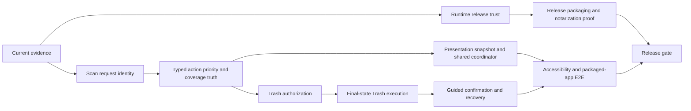

# Ryddi Audit Remediation Master Implementation Plan

> **For agentic workers:** REQUIRED SUB-SKILL: Use `superpowers:subagent-driven-development` (recommended) or `superpowers:executing-plans` to implement this plan task-by-task. Steps use checkbox (`- [ ]`) syntax for tracking.

**Goal:** Close the current Ryddi audit findings in an order that restores truth first, adds one useful recoverable action second, and proves the complete macOS experience before release.

**Architecture:** This is an orchestration plan for three decision-complete implementation plans. Core safety and state contracts land before filesystem mutation. The packaged-app E2E lane consumes those contracts and becomes the release proof. Signing/notarization publication remains a final credential-backed gate.

**Tech Stack:** Swift 6, SwiftUI, SwiftPM, XCTest, AppKit Accessibility, Foundation Trash APIs, codesign/notarytool/spctl, GitHub Actions.

## Detailed Plans

1. [Current Evidence And Scan Consistency](2026-07-12-ryddi-current-evidence-and-scan-consistency.md)
2. [Recoverable Trash And Release Trust](2026-07-12-ryddi-recoverable-trash-and-release-trust.md)
3. [macOS E2E Architecture And Polish](2026-07-12-ryddi-macos-e2e-architecture-and-polish.md)

## Required Order

## Parallelization Boundaries

- [ ] Complete Current Evidence Tasks 1-4 before starting mutation UI or final E2E assertions.
- [ ] Run Current Evidence Task 5 and Recoverable Trash Tasks 1-2 in parallel after the first four truth fixes land; they own different core files except `Models.swift`, so coordinate the additive receipt fields first.
- [ ] Run Runtime Release Trust Tasks 4-5 independently of Trash execution after agreeing on package-script ownership.
- [ ] Start accessibility IDs and responsive layout after scan request identity is stable.
- [ ] Start mechanical SwiftUI/CLI extraction only when the feature tests for the moved code are green; do not mix extraction and behavior changes in one commit.
- [ ] Make packaged-app E2E the integration lane after current evidence, shared coordinator, and Trash confirmation are merged.

## Milestone Gates

### Gate A: Truthful Read-Only App

- [ ] Historical audit evidence never appears as current.
- [ ] Superseded scans cannot commit.
- [ ] Action Center prioritizes safe/actionable work.
- [ ] Missing optional roots do not masquerade as denied access.
- [ ] `swift test --scratch-path "$PWD/.build"` and warnings-as-errors build pass.

### Gate B: Recoverable Action

- [ ] Only current-session, authorized, auto-safe `.trash` items can mutate the filesystem.
- [ ] Final identity, classification, policy, symlink, and recursive open-handle checks run for every action.
- [ ] Replacement and protected fixtures are skipped and unchanged.
- [ ] Successful actions produce Trash location and recovery evidence.

### Gate C: Packaged macOS Proof

- [ ] The `.app` completes Scan, Review, Plan, Dry Run, Confirm, Trash through app controls.
- [ ] Minimum, regular, and wide window screenshots pass.
- [ ] Accessibility contract and keyboard traversal pass.
- [ ] E2E JSON, screenshot, and protected-fixture hashes are present.

### Gate D: Release Trust

- [ ] Embedded build metadata matches version/build/commit.
- [ ] Developer ID signature verifies.
- [ ] Apple notarization status is Accepted.
- [ ] Stapler validation and Gatekeeper assessment pass.
- [ ] Release archive carries matching manifest and checksum.
- [ ] GitHub Release is created only after Gates A-D pass for the same commit.

## Global Non-Claims

- Ryddi does not perform direct cache deletion, remote cleanup, VM reset, privileged cleanup, scheduled destructive work, malware scanning, or automatic app-state deletion in this slice.
- Trash execution is recoverable but pathname replacement checks are not an atomic filesystem transaction.
- Reclaim estimates do not promise exact APFS free-space gains.
- Local unified logs are diagnostics, not telemetry, and must not contain private content.

## Final Verification

- [ ] Run `df -h /System/Volumes/Data`; stop below `30Gi`.
- [ ] Run `swift test --scratch-path "$PWD/.build"`.
- [ ] Run `swift build --scratch-path "$PWD/.build" -Xswiftc -warnings-as-errors`.
- [ ] Run touched script syntax and fake-tool tests.
- [ ] Run packaged-app E2E at all supported acceptance sizes.
- [ ] Run unsigned preview release check.
- [ ] Run signed/notarized release check only with available credentials and retain value-free proof.
- [ ] Run `git diff --check` and verify no stale audit wording remains with `rg -n "recentPlans.first|recentReceipts.first|automatic filesystem mutation is disabled" Sources README.md FEATURES.md docs`.
