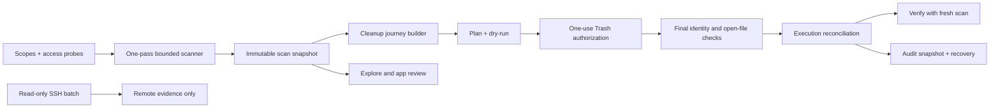

# Ryddi Post-Audit Remediation Master Implementation Plan

> **For agentic workers:** REQUIRED SUB-SKILL: Use `superpowers:subagent-driven-development` (recommended) or `superpowers:executing-plans` to implement this plan task-by-task. Steps use checkbox (`- [ ]`) syntax for tracking.

**Goal:** Resolve every confirmed 14 July 2026 audit finding while preserving Ryddi's local-first, recoverable, fail-closed cleanup model.

**Architecture:** Deliver the remediation as two independently shippable releases. `v0.3.1` repairs measurement truth, cancellation, current-state reconciliation, audit loading, permission probes, and release provenance before the UI is reorganized. `v0.4.0` then replaces the feature-inventory dashboard with one guided cleanup journey, adaptive native macOS workspaces, broader Accessibility proof, and focused model/view boundaries.

**Tech Stack:** Swift 6, SwiftUI Observation, SwiftPM, Foundation/FileManager, Darwin filesystem APIs where needed, CryptoKit, XCTest, Accessibility APIs, shell packaging, `codesign`, `notarytool`, `spctl`, GitHub Actions, macOS 14+.

## Global Constraints

- Run `df -h /System/Volumes/Data` before long build/test loops; stop below `30Gi` free.
- Use `swift test --scratch-path "$PWD/.build"`, `swift build --scratch-path "$PWD/.build"`, and repo-local derived data.
- Do not create unbounded scratch directories under `/private/tmp`; use one trapped `mktemp -d` directory per script.
- Preserve decoding compatibility for existing findings, coverage, plans, sessions, receipts, and audit records.
- Preserve the identity-bound, one-use, current-session Trash authorization and every final-state executor recheck.
- Never auto-select or mutate Codex sessions/memories/config/auth, browser profiles, credentials, user documents, GarageBand/Logic assets, VM disks, container volumes, databases, backups, or unknown state.
- Remote Targets remain read-only and report-only: no remote execute, prune, reset, sudo-password flow, agent install, or key storage.
- No telemetry, path upload, remote AI analysis, root helper, or Mac App Store sandbox migration.
- Do not publish a release from a dirty tree or reuse an existing version/build for different source.
- Every task follows TDD: failing focused test, minimal implementation, focused pass, broader regression pass, then a small commit.

---

## Delivery Decision

### Milestone A: `v0.3.1` Trust-Correctness Patch

Plan: [`2026-07-14-ryddi-v0.3.1-correctness-and-state.md`](2026-07-14-ryddi-v0.3.1-correctness-and-state.md)

Ship only after Ryddi can truthfully measure configured depth, distribute scan work fairly, stop cancelled scans, reconcile completed cleanup, load audit history off the main actor, probe actual scope access, and identify its source as `0.3.1 (4)`.

### Milestone B: `v0.4.0` Guided Cleanup Release

Plan: [`2026-07-14-ryddi-v0.4-guided-cleanup-and-e2e.md`](2026-07-14-ryddi-v0.4-guided-cleanup-and-e2e.md)

Ship only after the primary app experience is `Scan -> Recommendations -> Plan -> Dry Run -> Confirm -> Result -> Verify`, the sidebar is reduced to user tasks, dense reports use native list/table/inspector patterns, compact windows work at `760x600`, and packaged E2E covers the highest-risk screens and states.

## Finding Ledger

| ID | Confirmed finding | Severity | Owner plan/task | Closure evidence |
|---|---|---:|---|---|
| F01 | `measurementDepth` is not enforced | P1 | `v0.3.1` Task 1 | A depth-1 fixture excludes a depth-4 file and coverage is truthful. |
| F02 | Early roots exhaust one global item budget | P1 | `v0.3.1` Task 1 | Two-root fixture gives both roots measured evidence under a bounded budget. |
| F03 | Scanner re-enumerates subtrees and scales superlinearly | P1 | `v0.3.1` Task 1 | One filesystem traversal builds all bounded subtree measurements in memory. |
| F04 | Cancel only rejects result; filesystem work continues | P1 | `v0.3.1` Task 2 | Cancellation token stops traversal and the scan task becomes quiescent within one second on fixtures. |
| F05 | Cleanup success leaves stale findings and the old reclaim CTA | P1 | `v0.3.1` Task 3 | Completed paths disappear immediately and `Verify Cleanup` becomes primary. |
| F06 | Main-actor audit loading repeatedly enumerates/sorts the same directory | P1 | `v0.3.1` Task 4 | One index pass creates one immutable snapshot off-main. |
| F07 | Full Disk Access readiness uses `isReadableFile`, not an actual read probe | P1/P2 | `v0.3.1` Task 5 | Directory listing/open failures produce operation-specific denied/unknown evidence. |
| F08 | One mutable `isWorking` cannot represent overlapping operation state | P2 | `v0.3.1` Task 2 | Typed scan, cleanup, loading, review, and remote activities cannot clear one another. |
| F09 | Hashed `known_hosts` entries can be mislabeled unknown | P2 | `v0.3.1` Task 6 | `ssh-keygen -F` fixture recognizes literal and hashed entries. |
| F10 | CLI JSON output can crash through `try!` | P3 | `v0.3.1` Task 7 | Encoding errors return `CLIError` and nonzero status without a process trap. |
| F11 | Packaging signs the app with `codesign --deep` | P3 | `v0.3.1` Task 7 | Nested executable is signed explicitly; app is signed last and strictly verified. |
| F12 | Installed and current source both claim `0.3.0 (3)` | P1/P2 | `v0.3.1` Task 8 | Signed artifact embeds/tag-binds unique `0.3.1 (4)` source. |
| F13 | Twenty-five sidebar destinations expose implementation concepts | P2 | `v0.4` Task 1 | Five task-oriented destinations plus Settings replace the inventory. |
| F14 | Summary duplicates status, metrics, and actions | P2 | `v0.4` Tasks 2-3 | One typed journey exposes one primary action and compact secondary evidence. |
| F15 | Review Queues and Apps overpresent metrics in fixed rails | P2 | `v0.4` Task 4 | Native selection/list/table/inspector workspaces replace `300 + 760` fixed panels. |
| F16 | Minimum window is `980x680` and still forces deep scrolling | P2 | `v0.4` Task 5 | Critical flows pass layout/AX proof at `760x600`. |
| F17 | UI proof covers Summary but not dense or degraded states | P2 | `v0.4` Task 8 | Fixture matrix covers cleanup, valuable history, apps, permissions, remote, history, and post-action verification. |
| F18 | Remote probe opens nine independent SSH connections | P2 | `v0.4` Task 7 | Exact allowlisted read-only batches use one connection per probe/scan phase. |
| F19 | Large view/model/test files remain expensive to change safely | P2/P3 | `v0.4` Task 6 | Focused stores/views/tests replace touched monoliths without changing executor behavior. |
| F20 | SwiftPM exports duplicate app executable products | P3 | `v0.4` Task 6 | Only `RyddiApp` remains as the app product. |

## Cross-Release Architecture



## Required Public Contracts

The detailed plans must converge on these exact names:

```swift
public final class ScanCancellationToken: @unchecked Sendable
public struct ScanControl: Sendable
public struct ScanProgress: Hashable, Sendable
public struct ScanScopeCoverage: Codable, Hashable, Sendable
internal struct BoundedFileTreeWalker

public struct ExecutionReconciliation: Hashable, Sendable
public enum ExecutionReconciler

public struct AuditStoreSnapshot: Sendable
public enum ScopeAccessOperation: String, Codable, Hashable, Sendable
public struct ScopeAccessProbeResult: Hashable, Sendable
public protocol ScopeAccessProbing: Sendable

public enum CleanupJourneyStep: String, Codable, Hashable, Sendable
public struct CleanupJourneySnapshot: Hashable, Sendable
public enum CleanupJourneyBuilder
```

## Commit And Review Strategy

- [ ] Create an isolated worktree/branch from exact clean `main` before each milestone.
- [ ] Commit the plan files before production changes with `docs: plan post-audit remediation`.
- [ ] Keep each task to one behavior boundary and one reviewer gate.
- [ ] Request a safety review after scanner/reconciliation work and a macOS UI review after each UI workspace task.
- [ ] Rebase or merge only after exact-head CI is green; then verify exact-main CI independently.
- [ ] Keep `v0.3.1` and `v0.4.0` tags immutable and source-bound.

## Global Acceptance Gates

- [ ] All scanner depth/fairness/cancellation regression fixtures pass.
- [ ] All existing executor, authorization, symlink, policy, and open-handle tests remain green.
- [ ] `swift test --scratch-path "$PWD/.build"` passes with no new skips.
- [ ] `swift build --scratch-path "$PWD/.build" -Xswiftc -warnings-as-errors` passes.
- [ ] `bash -n Scripts/*.sh` and `git diff --check` pass.
- [ ] Packaged app E2E passes with protected fixtures intact and no personal paths in artifacts.
- [ ] Manual keyboard and VoiceOver QA is recorded separately; automated AX is not claimed as a substitute.
- [ ] Signed release passes strict nested/app `codesign`, notarization acceptance, stapling, Gatekeeper, checksums, manifest, and installed-app readback.
- [ ] `/Applications/Ryddi.app/Contents/Resources/Ryddi-build.json`, Git tag, manifest, ZIP basename, version, build, and source SHA all agree.
- [ ] Obsidian project and daily evidence record exact SHA, CI run, release proof, and explicit non-claims.

## Explicit Non-Goals

- No new destructive cleanup class.
- No direct cache deletion, automatic Trash emptying, or automatic audit pruning.
- No app-bundle uninstall execution or related-file deletion.
- No remote cleanup or sudo management.
- No duplicate finder, malware scanner, updater, RAM cleaner, or generic optimizer scope.
- No broad rewrite of `ReclaimerCore`; only touched responsibilities are extracted.
