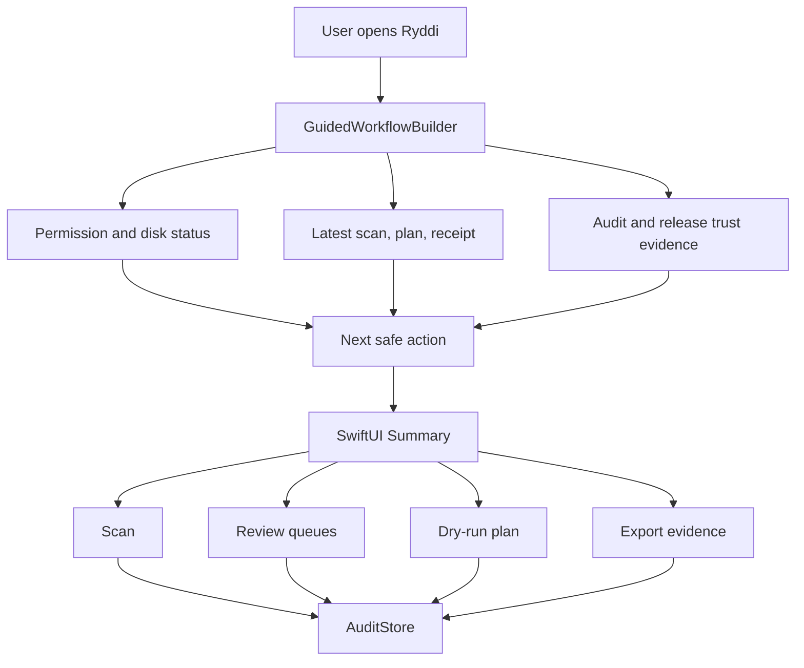
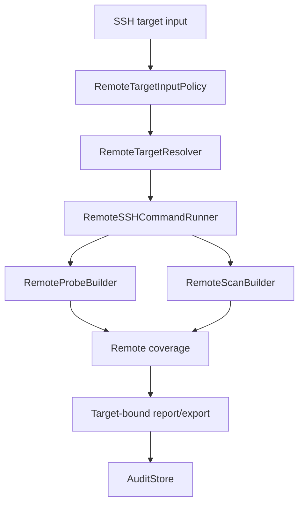

# Ryddi Guided Usefulness Release Design

## Filled Brief

Build Ryddi's guided usefulness release slice in Swift 6, SwiftUI, SwiftPM, and repo documentation. It should include a one-primary-action app proof ladder, machine-verifiable cleanup gates, preview-first safe reclaim lanes for package caches and AI-agent cache retention, remote SSH coverage and target-identity correctness, typed manifest-backed v0.2 release trust proof, and public onboarding/support docs. Make it feel calm, evidence-first, conservative, and genuinely useful, using clear scan coverage, explicit safety labels, dry-run receipts, target-bound history, and release proof that can be verified from local artifacts. Output as committed design, implementation plan, code changes, tests, docs, release checks, and app smoke evidence.

## Product Thesis

Ryddi's next high-impact move is not a larger command surface. The app already exposes many scanners and reports. The next release should make Ryddi trustworthy and useful in the first minute:

- It should open with one obvious next safe action.
- It should explain why a large item is not always reclaimable.
- It should turn only machine-verifiable evidence into default cleanup plans.
- It should treat degraded local permissions and failed remote scans as degraded evidence, not as clean results.
- It should connect release trust claims to signed/notarized manifest proof instead of prose.

Ryddi should win by being the Mac cleaner that tells the truth before it offers a button.

## Current Evidence

The current `feature/remote-targets` branch already contains the core ingredients:

- `ReclaimerCore` models, rules, plan building, execution receipts, native cleanup guidance, audit storage, trust readiness, remote targets, and dogfood reports.
- `reclaimer` CLI commands for local reports, remote targets, audit hygiene, scheduling, package/cache guidance, and release checks.
- SwiftUI app surfaces for Summary, review queues, permissions, active handles, audit history, remote targets, recovery, holding area, automation, and rule catalog.
- Recent UI fixes for packaged rule resources, dashboard usability, small-window layout, Full Disk Access onboarding, and permission coverage copy.

Real-machine scan signal from the synthesis:

- `3814` findings.
- `50.25 GB` allocated scanned.
- `1.68 GB` auto-safe.
- Codex/AI-agent storage is still the largest bucket at `26.47 GB`, mostly protected or review-heavy.

That gap is the product problem: users see big numbers, but Ryddi must make the safe next move obvious without overstating what it can reclaim.

## User Promise

Ryddi will:

- Scan local developer and general Mac storage with clear coverage status.
- Sort results into review queues that explain what is safe, conditional, valuable, protected, or unknown.
- Build dry-run cleanup plans only from evidence that can be rechecked before action.
- Prefer native cleanup tools when those tools understand their own storage better than Ryddi can.
- Keep remote SSH targets report-first and non-destructive.
- Store audit evidence locally and make it visible.
- Say when a release is signed, notarized, stapled, and Gatekeeper-accepted only when the manifest proves it.

Ryddi will not:

- Pretend inaccessible local paths were scanned.
- Treat failed SSH commands as an empty remote machine.
- Auto-delete Codex sessions, memories, configs, browser profiles, VM/container disks, credentials, user documents, GarageBand/Logic assets, databases, or unknown app state.
- Run destructive remote cleanup in this slice.
- Upload paths, telemetry, command output, or cleanup evidence.
- Claim exact APFS or remote filesystem reclaim where snapshots, hard links, sparse files, or native-tool accounting can make exact reclaim unknowable.

## First-Run Journey

The Summary view should become a proof ladder. Each state has one primary call to action and a short reason.

1. Permission Review
   - Trigger: configured scan scopes are degraded or protected folders are unreadable.
   - Primary action: open a guided permissions panel.
   - Evidence: readable scope count, unreadable roots, whether the installed app bundle identity changed since permission grant.

2. Scan
   - Trigger: no recent scan exists, rules changed, selected scope changed, or the user asks to refresh.
   - Primary action: scan current scope.
   - Evidence: disk pressure, scope preset, rule version, scan start/end, inaccessible count.

3. Review Queues
   - Trigger: scan exists but no current plan exists.
   - Primary action: open review queues or create a safe plan if auto-safe evidence exists.
   - Evidence: auto-safe bytes, conditional bytes, review-required bytes, valuable history bytes, protected bytes.

4. Plan
   - Trigger: findings exist and at least one item has satisfied cleanup gates.
   - Primary action: create a dry-run plan.
   - Evidence: gate classes, expected reclaim, skipped reasons.

5. Dry Run
   - Trigger: plan exists but no receipt exists for the current plan.
   - Primary action: run dry-run.
   - Evidence: planned items, skipped active handles, native tool previews, protected categories.

6. Reclaim or Export
   - Trigger: dry-run receipt exists and all selected actions remain eligible.
   - Primary action: reclaim safely when the plan contains only eligible local actions; otherwise export a report.
   - Evidence: receipt ID, executor revalidation status, recovery path, audit trail.

7. Recovery
   - Trigger: holding area or Trash receipts exist.
   - Primary action: review recovery center.
   - Evidence: restore locations, expiration policy, receipt IDs.

## Summary Information Architecture

The first screen should answer four questions:

- "What is my disk pressure?"
- "How complete is this evidence?"
- "What can I safely do next?"
- "What is protected or needs a human decision?"

Preferred Summary structure:

- Header: disk pressure, scan coverage, selected preset/scope, last scan.
- Primary action band: one large action, one secondary action, short reason, expected outcome.
- Safety totals: safe maintenance, quit app first, use native tool, valuable history, protected, unknown.
- Largest decisions: top findings with next action chips, not raw table density by default.
- Trust cards: permissions, active handles, audit history, automation, release trust.
- Evidence drawer: command receipts, rule version, manifest proof, inaccessible roots.

The dense table can remain available, but it should not be the first impression.

## Safety Model

The release should preserve the existing fail-closed posture:

- English condition strings are display copy, not authority.
- Typed `PlanConditionKind` values define what gates must be checked.
- Plan building can select only items whose typed gates have satisfied evidence.
- Execution must re-resolve metadata and re-run final safety checks immediately before performing an action.
- Open-handle checks must block directories recursively when the candidate is a directory.
- Symlinks must remain blocked for direct cleanup.
- Native-tool actions should default to dry-run or preview commands when available.
- Destructive remote actions remain absent.

Additional gate semantics for this slice:

- Age gates must carry a numeric minimum age in rule evidence.
- Retention gates must carry a retention policy name and a selected retention horizon.
- Open-handle gates must report checked path and whether recursion was used.
- Native-tool gates must name the native tool and whether a preview command exists.
- Final-classification gates must compare the current rule match against the planned rule class.

## Local Safe Reclaim Lanes

### Package Caches

Package caches are the best first safe reclaim lane because package managers already expose cleanup semantics and dry-run/preview patterns.

The app should show:

- Manager: Homebrew, npm, pnpm, Yarn, Cargo, Go, Gradle, Maven, CocoaPods, pip.
- Cache path and estimated allocated size.
- Native command guidance.
- Whether Ryddi can produce a preview-only native plan.
- Clear distinction between "Ryddi will run native preview" and "user should run this command manually."

Default behavior:

- Prefer `NativeToolGuidance`.
- Include only allowlisted commands.
- Do not include package caches in a direct delete plan when a native command is available.
- Show direct cache delete only for allowlisted reproducible caches with open-file and final-classification checks.

### AI-Agent Storage

AI-agent storage is high value but mixed-risk. Codex sessions, archived sessions, memories, auth/config, and active DB state remain protected or review-heavy.

The app should show:

- Sessions and archived sessions as valuable history or preserve-by-default.
- Logs, transient cache, debug bundles, and stale generated scratch as candidates only when typed age/retention gates prove eligibility.
- A retention preview that groups by owner, category, age, and recovery behavior.
- A dry-run receipt before any Trash/quarantine/compress action.

Default behavior:

- No automatic session removal.
- No direct delete for Codex state DBs, memories, config, auth, or unknown stores.
- Compress or quarantine only when the item is review-selected and recovery is clear.

## Remote Targets

Remote Targets remain read-only/report-first in this release. The trust bug class is not remote cleanup; it is misleading evidence.

Remote scans need explicit coverage:

- `complete`: core probe and scan commands succeeded enough to classify storage.
- `partial`: at least one evidence area failed, timed out, or was permission-denied, but other evidence is usable.
- `unreachable`: no core probe or scan command succeeded.
- `unsupported`: target responded but OS/tooling does not match the Linux VPS preset.

Remote UI and CLI should:

- Mark unreachable scans as degraded instead of showing an empty report.
- Exclude unreachable scans from default growth/history comparisons.
- Bind remote exports to the selected target identity, not just the latest audit record.
- Track host key fingerprint continuity when available.
- Warn when a target alias resolves to a different host, user, port, or fingerprint than a saved report.

Remote reports should include:

- Target alias and resolved host/user/port when available.
- Known-hosts state and fingerprint when available.
- Command receipts with bounded previews.
- Disk and inode pressure.
- Native guidance for manual journald, apt, Docker, and deploy-release review.
- Explicit non-claims: no cleanup executed, no permission granted, no exact reclaim promise, no remote privilege management.

## Release Trust

Release trust should be typed and manifest-backed.

The app and CLI should never derive readiness from substring checks such as whether a string contains `notarized`. Instead, release trust should be represented as structured evidence:

- version
- build number
- artifact name
- artifact SHA-256
- codesign identity
- hardened runtime proof
- notarization status
- staple validation result
- Gatekeeper assessment result
- manifest creation time
- source commit

Trust readiness should show:

- Local debug build.
- Signed but not notarized build.
- Notarization submitted but not accepted yet.
- Signed, notarized, stapled, Gatekeeper accepted.
- Manifest missing or stale for the current app bundle.

## Public Comprehension

Ryddi should feel general-purpose, while developer cleanup remains the deepest lane.

Docs should provide:

- A start-here path for normal Mac users.
- A developer cleanup path for package caches, Xcode, containers, AI-agent storage, and remote VPS targets.
- A support diagnostics command that gathers local, redacted evidence.
- Issue templates for crash, scan coverage, unsafe classification, remote target, release/install, and feature request.
- A `SECURITY.md` that explains local-first behavior, secret handling, remote SSH boundaries, and how to report vulnerabilities.
- Screenshots that show the guided Summary, review queues, remote report, and release trust state.

## Data Flow

Remote data flow:

## Failure Modes And Required Behavior

- Full Disk Access granted to a previous app bundle: show degraded coverage and explain that macOS may bind permission to the installed app identity.
- Scan has inaccessible paths: show readable versus configured scopes and link to permission review.
- Large protected item exists: show size, why protected, and what review path exists.
- Native tool unavailable: keep guidance manual and mark the lane degraded.
- Open file handle present: skip action and show checked path.
- Remote target unreachable: save only as degraded evidence when explicitly requested, show no reclaim estimate, and exclude from default history.
- Remote target identity changed: show continuity warning before comparing reports.
- Manifest missing: show local/debug trust state.
- Notarization not accepted: show pending or failed state, no release-ready claim.

## Verification Expectations

Before this slice is considered complete:

- `df -h /System/Volumes/Data` reports at least `50Gi` free before long loops.
- Targeted Swift tests pass for guided workflow, gates, package lane, agent lane, remote coverage, release trust, and docs-facing CLI commands.
- Full `swift test --scratch-path "$PWD/.build"` passes.
- `swift build --scratch-path "$PWD/.build"` passes.
- `Scripts/release-check.sh` passes for unsigned preview; signed release proof waits for Developer ID and notarization credentials.
- `git diff --check` passes.
- The installed app opens to a Summary that fits small and normal windows and shows one primary next action.
- Remote scan failures are visibly degraded in CLI and app.
- Documentation avoids cleanup claims that the product cannot prove.

## Parallel Workstreams

The execution plan should split the work into these independent goals:

- App proof ladder and next safe action.
- Machine-verifiable cleanup gates.
- Package and AI-agent safe reclaim lanes.
- Remote coverage and target identity.
- v0.2 release trust proof.
- Public onboarding and support docs.

The main agent owns synthesis, verification, commits, and the final release decision.
