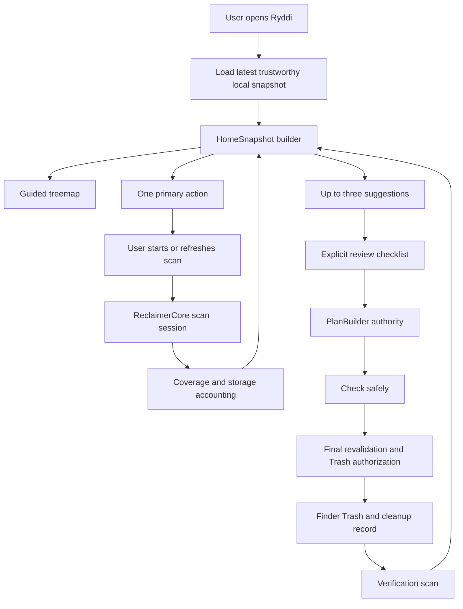

# Ryddi Guided Map Regular-User Design

**Date:** 2026-07-17  
**Status:** Approved in conversation; ready for implementation planning  
**Baseline:** `feature/protect-foundation` at `094add7d6aa2e43c228840ad32fd1f063e521d05`  
**Related plan:** `docs/superpowers/plans/2026-07-14-ryddi-v0.4-guided-cleanup-and-e2e.md`

## Goal

Make Ryddi immediately understandable and useful to regular Mac users while preserving its evidence-first safety authority.

Ryddi should combine:

- DaisyDisk's immediate whole-disk comprehension, proportional spatial hierarchy, drill-down, Quick Look, and low cognitive load;
- SquirrelDisk's obvious start, approachable large-file discovery, and simple mental model; and
- Ryddi's typed classifications, honest scan coverage, protected-data defaults, final identity and open-handle checks, dry-run authority, Trash-first execution, receipts, and explicit non-claims.

The result is a guided disk explorer, not a dashboard of cleanup subsystems and not a one-click cleaner.

## Product Promise

Ryddi answers four questions in order:

1. Where did my disk space go?
2. What deserves my attention?
3. What can I safely choose to do?
4. What actually happened afterward?

The user-facing flow is:

> Map = understand -> Suggestions = decide -> Review = authorize -> History = verify and recover

The internal safety flow remains:

> Scan evidence -> typed classification -> plan authority -> dry run -> final revalidation -> one-use Trash authorization -> receipt -> verification scan

Simpler presentation must not create a second cleanup authority or weaken any existing gate.

## Approved Product Decisions

### Guided Map Home

The default home screen combines:

- a prominent proportional treemap;
- a plain-language disk-pressure and evidence headline;
- at most three ranked cleanup or review suggestions; and
- exactly one primary next action.

The map answers "where?" and the suggestions answer "what could I do?" Neither surface grants cleanup permission.

### User-Started Scanning

Ryddi never starts a heavy scan merely because the app opened.

- First launch shows current disk capacity and one primary **Scan your Mac** button.
- The scan is user-started, cancellable, and visibly scoped.
- Later launches immediately show the latest trustworthy map, its age, its scope, and its coverage quality.
- **Scan again** is the explicit refresh action.
- An interrupted or failed refresh never replaces a prior trustworthy map with empty or misleading results.

### Treemap, Not Sunburst

The primary visualization is a treemap because it:

- uses rectangular space efficiently;
- makes proportional size comparisons easier;
- leaves more room for direct labels;
- works well beside ranked suggestions; and
- can expose the existing hierarchy through click-to-drill-down and breadcrumbs.

Sunburst navigation and simple category bars were considered but rejected as the primary visualization. A sunburst produces narrow unlabeled segments; category bars are accessible but do not provide the desired spatial exploration.

### Nothing Preselected

Ryddi may rank and explain suggestions, but it never converts a recommendation into user intent.

- Nothing begins selected.
- **Review suggestions** opens an explicit checklist.
- **Select safe maintenance** may exist only inside review as a secondary user action.
- That action selects only the exact current-session set independently accepted by the core planner.
- Protected, conditional, review-only, unknown, stale, active, symlinked, or identity-changed items remain unselected or unavailable as required by core authority.

## Primary Information Architecture

Ryddi has three primary destinations for regular users:

1. **Home**
   - Guided treemap.
   - Scan status and freshness.
   - Up to three ranked suggestions.
   - One primary next action.

2. **Explore**
   - Full treemap drill-down.
   - Largest folders and files.
   - Applications and leftovers.
   - Category views, search, sorting, and filters.
   - Quick Look, Reveal in Finder, Open in Terminal where appropriate, and Copy Path.

3. **History**
   - Cleanup and native-tool receipts.
   - Verification results.
   - Recovery guidance.
   - Prior scan and growth evidence.

Settings contains capabilities that should not compete with the first-run journey:

- permissions and access review;
- scan scopes and saved scope sets;
- protections and exclusions;
- automation;
- rule catalog;
- advanced developer storage tools;
- Remote Targets;
- release trust and diagnostic evidence; and
- expert CLI guidance.

Remote Targets and developer-specific tooling remain first-class capabilities, but they are advanced modes rather than primary destinations for regular users.

This design supersedes the five-primary-destination information architecture in the existing v0.4 plan. It preserves that plan's typed journey, focused stores, responsive layout, E2E, remote batching, and release-proof work where those requirements do not conflict with this specification.

## First-Minute Journey

### First Launch

1. Ryddi shows total capacity, used space, and available space without claiming a completed scan.
2. The primary action is **Scan your Mac**.
3. A short scope preview explains what will be inspected and whether access appears limited.
4. The user starts the scan.
5. Ryddi shows progress, current scope, measured-item count, and Cancel.
6. The completed Guided Map appears.
7. The headline separates measured allocated space from safely reviewable estimated reclaim.
8. At most three suggestions appear below or beside the treemap.
9. The primary action becomes **Review suggestions** when actionable suggestions exist; otherwise it becomes the most useful honest alternative, such as Explore Largest Files or Review Access.

### Later Launches

1. Ryddi renders the latest trustworthy map immediately.
2. The map shows scan time, scope, and Complete, Bounded, or Limited visibility.
3. Stale evidence may remain useful for exploration but cannot authorize cleanup.
4. **Scan again** refreshes the evidence only after the user requests it.

## Guided Treemap

### Visual Encoding

- Rectangle area represents allocated bytes within the currently viewed hierarchy.
- Color represents understandable storage categories, not safety authority.
- Safety is communicated with text, badges, icons, selection affordances, and inspector copy.
- Color is never the sole signal.
- Sufficiently large rectangles show name and allocated size directly.
- Small entries are aggregated into honest bounded groups such as **Other measured items**, without changing their underlying safety classifications.
- Inaccessible, skipped, or unmeasured space remains visible as **Limited visibility** rather than disappearing from the map.

Initial regular-user categories should use plain language:

- Applications
- Personal Files
- Developer Files
- Media
- Caches
- System
- Other Measured Items
- Limited Visibility

Category labels do not imply ownership, cleanup eligibility, or independent reclaim.

### Interaction

- Click a rectangle to drill into its children.
- A persistent breadcrumb shows the current hierarchy and supports back navigation.
- Selecting a rectangle opens an inspector with plain-language details.
- Space invokes Quick Look when the selected item supports it.
- Secondary actions include Reveal in Finder, Copy Path, and Open in Terminal where allowed.
- The treemap never directly deletes, Trashes, or adds an item to a cleanup plan.
- A finding can enter cleanup review only through a typed suggestion or an explicit review action that delegates selection authority to the existing core planner.

### Accessible Equivalent

The same hierarchy is available as a keyboard-navigable outline sorted by allocated size.

VoiceOver exposes:

- item name;
- hierarchy level;
- category;
- allocated size;
- whether measurement is complete, bounded, or limited;
- whether a regular-user action is available; and
- the result of invoking that action.

Treemap and outline selection remain synchronized.

## Suggestions

### Default Limit And Ranking

Home shows at most three suggestion groups. Additional findings remain available through **Show more** and Explore.

Suggestions rank by:

1. current-session eligibility and evidence freshness;
2. conservative estimated immediate reclaim;
3. classification confidence;
4. consequence clarity for a regular user; and
5. usefulness under current disk pressure.

The ranking cannot promote a less-safe suggestion above a safer one merely because it is larger.

When strictly eligible findings exist, the visible suggestions should account for at least 85% of strictly eligible estimated reclaim whenever three coherent groups can do so. If they cannot, Home must disclose that more suggestions are available rather than pretending the visible three are complete.

### Suggestion Content

Each suggestion states:

- what it contains;
- why Ryddi surfaced it;
- allocated size;
- conservative estimated reclaim, when independently supportable;
- what happens if the user proceeds;
- whether the data can be recreated;
- the required next step; and
- any important non-claim.

Examples:

- **Old build files — 12.4 GB allocated**  
  Safe to recreate when the related project builds again.

- **Package download caches — 4.5 GB allocated**  
  Package tools can download these files again.

- **Downloads not opened in a year — 7.1 GB allocated**  
  Personal files. Review each item before deciding.

### Suggestion Classes

Regular-user presentation may use:

- **Safe maintenance**
- **Quit app and check again**
- **Use the app's maintenance tool**
- **Review personal files**
- **Keep by default**
- **Protected**
- **Not enough evidence**

These labels map from typed core states. They never replace or infer core state from English copy.

## Cleanup Review And Action Model

### User-Facing Flow

The visible flow is:

1. **Choose items**
2. **Review cleanup**
3. **Check safely**
4. **Move to Trash**
5. **Scan again to verify**

The technical flow underneath remains dry-run, final identity and classification checks, user policy, symlink and containment checks, recursive active-handle checks, one-use authorization, execution receipt, and reconciliation.

### Selection Rules

- No item starts selected.
- Protected items have no selection control.
- Review-only personal files may be inspected or opened in Finder but do not inherit Trash eligibility from the suggestion UI.
- Conditional items explain the unmet condition and offer a specific next action such as **Quit app and check again**.
- Native-tool findings offer **Open maintenance instructions** or an allowlisted native preview when supported.
- Stale plans and receipts from another scan session are ignored.
- If presentation selection and `PlanBuilder` acceptance disagree, the item fails closed and remains unselected.

### Regular-User Copy

Use purpose-oriented language:

| Internal concept | Regular-user language |
| --- | --- |
| Dry run | Check safely |
| Allocated bytes | Space used on this disk |
| Estimated reclaim | Space Ryddi expects may become recoverable |
| Identity mismatch | Changed since the scan; skipped |
| Active handle | In use by an open app |
| Coverage degraded | Limited visibility |
| Coverage bounded | Some smaller or deeper items were not measured |
| Execution receipt | Cleanup record |
| Reconciliation required | Scan again to verify |

Do not call files **cleaned**, space **reclaimed**, or a result **verified** until the corresponding action and measurement actually prove that claim.

## State And Failure Design

Every state retains a useful next action and preserves the last trustworthy evidence.

### No Scan

- Show capacity and used/free disk status.
- Primary action: **Scan your Mac**.
- Do not render an empty treemap as if it were a result.

### Scanning

- Show progress, current scope, measured items, and elapsed time.
- Primary action: **Cancel scan**.
- Keep any prior trustworthy map visibly separate from in-progress evidence.

### Cancelled

- Do not accept late results.
- Keep the prior trustworthy map.
- Label the interrupted attempt incomplete.
- Primary action: **Scan again**.

### Limited Access

- Render measured content plus a visible **Limited visibility** region.
- Explain which high-level areas could not be measured without exposing irrelevant implementation detail.
- Primary action: **Review access** or **Continue with limited results**, depending on the requested task.

### Bounded Scan

- Explain that smaller or deeper content may be omitted.
- Keep the map useful for exploration.
- Require a targeted current scan before action evidence is accepted where necessary.

### Nothing Safe Suggested

- Keep the treemap and Explore useful.
- Explain that large does not necessarily mean disposable.
- Primary action: **Explore largest files**.

### Changed Since Scan

- Skip the item.
- Explain that it changed after scanning.
- Primary action: **Scan again**.

### Cleanup Completed

- Show exactly what moved to Finder Trash and what was skipped.
- Do not claim increased free space merely because items entered Trash.
- Primary action: **Scan again to verify**.

### Error

- Preserve the latest trustworthy map.
- Explain the failed operation in plain language.
- Provide one useful recovery action.
- Never translate an error into an empty or complete-looking result.

## Component Boundaries

### Core Authority

`ReclaimerCore` remains the sole authority for:

- scan sessions and coverage;
- filesystem identity and storage accounting;
- finding classification;
- cleanup eligibility;
- plans and conditions;
- dry-run and execution receipts;
- Trash authorization;
- execution reconciliation; and
- recovery guidance.

### Presentation Models

The implementation plan should introduce focused, deterministic adapters rather than make SwiftUI infer meaning:

- `GuidedMapSnapshot` — current trustworthy map, scope, coverage, freshness, and visible hierarchy.
- `TreemapNode` — stable identity, parent identity, label, allocated bytes, category, measurement state, and child nodes.
- `HomeSuggestion` — plain-language projection of typed current-session evidence.
- `HomeSnapshot` — headline, map snapshot, up to three suggestions, and one primary action.
- `HomeAction` — typed regular-user actions routed back to existing stores and core authority.

Presentation models may simplify and aggregate display, but they cannot grant cleanup permission.

### App Stores

The existing v0.4 focused-store direction remains useful:

- scan workspace store;
- cleanup journey store;
- exploration store;
- history and recovery store;
- advanced settings and remote stores; and
- one coordinator for typed routing.

No view should load the filesystem, parse audit directories, run SSH, or derive plan eligibility.

## Data Flow

## Accessibility And Responsive Layout

- Support 760x600, 980x680, 1280x800, and 1600x1000 reference windows.
- At compact widths, the treemap and suggestions stack vertically.
- At regular and wide widths, suggestions may sit beside or below the treemap according to measured readability.
- The primary action remains visible and keyboard reachable at every supported size.
- Support light mode, dark mode, Increase Contrast, Reduce Motion, Full Keyboard Access, and VoiceOver.
- Never communicate category, safety, selection, error, or coverage through color alone.
- Motion may support hierarchy transitions but must be optional and must not delay interaction.
- Confirmation and result sheets are dismissible and fully operable without a pointer.

## Performance Expectations

- Loading a saved trustworthy snapshot should make Home useful without waiting for a new scan.
- User-started scanning must remain cancellable, and cancellation must quiesce descendant scheduling promptly.
- Treemap layout must be computed off the main actor from immutable presentation input.
- Route changes and category/filter changes with 5,000 findings should complete within 500 ms on the reference Mac.
- Saved audit/history loading with 5,000 known records should complete within 1,500 ms on the reference Mac.
- The implementation plan must define a measured treemap layout and interaction budget before release; animation cannot mask slow computation.

## Verification And Acceptance

### Behavioral Invariants

- A new user reaches a meaningful treemap with one explicit **Scan your Mac** action.
- No cleanup item is preselected.
- Protected or ineligible findings never enter a cleanup plan.
- Presentation-selected IDs exactly match or are a strict subset of the IDs independently accepted by `PlanBuilder`.
- A stale map remains useful for exploration but cannot authorize cleanup.
- Cancelled, bounded, degraded, and failed scans never appear complete.
- Moving an item to Trash does not itself create a free-space claim.
- Verification requires a later observed state.

### Comprehension Targets

- At least 85% of measured allocated bytes appear in the initial treemap or an explicit measured/limited aggregate.
- When eligible findings exist, the three default suggestions expose at least 85% of strictly eligible estimated reclaim whenever coherent grouping allows it.
- A regular user can complete Scan -> Review -> Check -> Trash -> Verify without opening Settings or an advanced destination.
- Moderated testing with at least eight non-developer Mac users checks:
  - understanding of the treemap hierarchy;
  - understanding of allocated space versus estimated reclaim;
  - understanding that nothing is selected automatically;
  - understanding of Safe Maintenance, Review, and Protected states; and
  - ability to complete the primary journey without instruction.

Ryddi's no-telemetry policy remains unchanged. Product metrics come from deterministic local E2E fixtures, opt-in moderated sessions, and explicit usability-test notes, not production analytics.

### Automated And Packaged Proof

The implementation plan must include:

- pure unit tests for treemap aggregation, hierarchy, stable identity, suggestion ranking, copy mapping, and primary-action precedence;
- compatibility tests against `PlanBuilder`;
- cancellation, stale-evidence, bounded, degraded, and error-state tests;
- keyboard and Accessibility identifier contracts;
- packaged app scenarios for no-scan, complete scan, bounded scan, limited access, nothing eligible, mixed suggestions, changed-after-scan, confirmed Trash, verification, and recovery;
- multi-size light/dark screenshot proof;
- manual VoiceOver and Increase Contrast acceptance; and
- exact signed/notarized installed-app verification before release claims.

## Anti Review Synthesis

Anti/Opus reviewed the current repository context and existing v0.4 direction, then compared three focused product directions:

1. pressure-relief dashboard;
2. cleanup triage inbox; and
3. annotated spatial map.

Useful Anti recommendations retained here:

- progressive disclosure;
- a hard cap on default suggestions;
- structural selection safety rather than warning-only safety;
- plain-language copy;
- measurable first-session comprehension;
- explicit degraded and empty states; and
- advanced features outside the primary journey.

The final design differs from Anti's recommended cleanup-inbox direction. Ryddi intentionally keeps a prominent treemap because whole-disk comprehension is a core part of the requested DaisyDisk and SquirrelDisk learning, and because Ryddi should remain useful even when no cleanup is safe.

Anti's production telemetry suggestion was rejected because it conflicts with Ryddi's local-only, no-telemetry promise.

## Out Of Scope For This Release

- automatic scanning on app launch;
- background scanning or filesystem watching;
- production telemetry or analytics;
- one-click clean-all behavior;
- preselected cleanup items;
- direct deletion from the treemap;
- remote cleanup execution;
- automatic personal-file deletion;
- automatic duplicate deletion;
- malware scanning, RAM cleaning, or generic speed-boost claims;
- root helpers;
- cloud path upload or remote analysis;
- lasso selection or bulk map selection;
- animated sunburst navigation;
- historical pressure widgets or notification nudges; and
- Mac App Store distribution changes.

## Release Boundary

This design is complete only when the implementation plan maps every requirement to an independently testable task and the packaged signed app proves the regular-user journey without weakening existing safety, privacy, storage-truth, or release-trust contracts.
